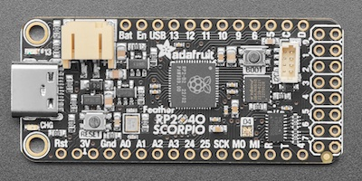
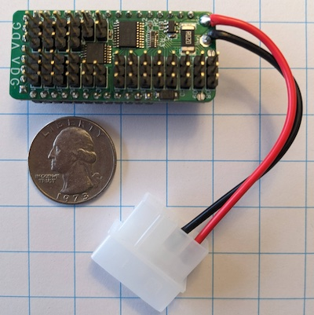

# Welcome to the Super Scorpio project!
Chain and control multiple NeoPixel/ARGB LED strips with the Super Scorpio!

## Background
I was looking for an excuse to work with the RP2040 microcontroller and I found one. My computer case "needed" some RGB
bling, and as I added addressable RGB kits here and there for the pumps, plates, and fans, etc. I quickly found out
that most-all off-the-shelf ARGB kits have zero provisions for daisy-chaining their individual ARGB segments. This is
unfortunate since my motherboard provides just 1 ARGB header while my video card also provides just 1 ARGB header. Both
of these ARGB sources have hardware to make pretty blinken-lights while also color encoding some hardware state
information like CPU/GPU temps, etc.

True, there are some off-the shelf ARGB controller hubs out there, but none did what I wanted, so the Super Scorpio
project was born. With my Super Scorpio I can now read the two ARGB data streams from both my motherboard and my video
card and then arbitrarily map their pixel data outputs onto all of my separate kits' individual ARGB LED segments.

## Hardware: The Super Scorpio ARGB Controller Hub
The Super Scorpio ARGB controller hub consists of an off-the-shelf Adafruit Feather RP2040 Scorpio board paired with my
custom Super Scorpio FeatherWing board.

### Adafruit's Feather RP2040 Scorpio board
The Adafruit Feather RP2040 Scorpio board includes a USB Type-C connector for powering and programing the RP2040
processor, 264KB of SRAM, 8MB of SPI Flash, a 12MHz crystal to run at a reliable 125 MHz, and 8 level shifters with
dedicated pins to control 8 channels of 5V ARGB data output.

https://learn.adafruit.com/introducing-feather-rp2040-scorpio
https://github.com/adafruit/Adafruit-Feather-RP2040-SCORPIO-PCB



### My custom Super Scorpio FeatherWing board
My custom Super Scorpio FeatherWing board mounts on top of the Adafruit Feather RP2040 Scorpio board, adding a 5V power
bus, a current sensor, level shifters, and many more pins for 5V ARGB I/O connections using the standard compact VDG pin
layout.

My EasyEDA project for the [Super Scorpio FeatherWing board](https://oshwlab.com/steffenyount/drgb-controller_copy_copy_copy_copy)



### Features
The Super Scorpio ARGB Controller Hub includes the following hardware features:
* Molex power connector to deliver 50W of LED power from an ATX power supply
* LED power/current monitoring over a 0-11A input range (ADC pin A0)
* LED power and data I/O connectivity provided with compact DG/VDG pin headers
* 4x level shifted 5V ARGB data input channels (GPIO pins 5,6,24,25)
* 16x level shifted 5V ARGB data output channels (GPIO pins 8-23)
* 264KB of SRAM
* 8MB of SPI Flash
* 2x 32-bit Cortex M0+ cores running at ~125 MHz
* 2x PIO blocks (RP2040 programmable input/output processors) for ARGB data I/O offloading
* 12x DMA controllers


## Software: The Super Scorpio
The Super Scorpio is implemented in C and makes heavy use of the Raspberry Pi Pico C SDK.

### Theory of operation
#### Limitations of the current implementation 
* System state is not persisted between reboots
* There is no UI for runtime configuration
* All configurations are either hard coded in at compile time or set dynamically by the LED segment discovery process
during startup

#### The startup sequence
* Runs [main()](main/main.c) on core0.
* Hardware is initialized: stdio to USB, DMA bus priority, GPIO functions/pads/IO, `systick` counter, IRQs enabled, etc.
* RX/TX channel configuration structures are initialized
* PWM is initialized for direct channel LED control
* DMA feeds and ADC are initialized for power monitoring
* LED segment discovery is run and TX Channel configs are updated to reflect the attached LED segments
* Channel configs are further updated with hard coded channel override settings
* TX Channel LEDs are lit up to test max power draw
* Channel LED segment config lengths are truncated if necessary to ensure the LED power limit
* Pixel data feeds are assigned to the channels
* Runs [core1_main()](main/main.c) on core1
* The `systick` counter hardware is initialized on core1 and an attempt is made to sync the two core's `systick`
counters
* GPIO functions are reconfigured for PIO based channel LED data output streaming
* The pixel data feed and LED byte data TX processing loop is launched on core1
* The asynchronous pixel data input processing loop is launched on core0
* The tick log stdio print loop is launched on core0

#### The runtime loops
* Last in the TX chain are 4x PIO processors feeding 4x channels of LED bit data each, for a total of 16x GPIO-pins
* `tx_bytes` are serialized as LED bit data on the output GPIO-pins at a steady 800kbps (that's 10us or 1250 CPU ticks
per Byte)
* The PIO processors transmit 8-bits into 4 channels for every one `tx_data` input they receive
* The PIO processors can buffer up to 4 of these `tx_data` inputs in their input queues
* DMA marshals `tx_bytes` from `tx_pixels` into the `tx_data` staging buffer before copying them into the PIO queues 
* The pixel TX loop runs on core1 on a byte-by-byte cadence and coordinates the double buffer `tx_data` staging area
* It advances the `tx_bytes_feed` state machines to populate the `tx_data` staging buffers with `tx_pixel` data
* It triggers DMA to feed the `tx_data` into the PIO queues
* The pixel TX loop's cadence is metered by DMA feed completion and PIO input queue levels. These determine when the
`tx_data` double buffers may be swapped and when the next DMA feed may be triggered
* The `tx_bytes_feed` state machines choreograph frames of LED byte data per channel: start, middle, and end
* They mind the 3-byte (or 4-byte) pixel counts and call channel pixel-feeds to load their next `tx_pixel` into
`tx_data`
* Data frames are started either based on a timer interval or the `pixel_feeds_ready` flag being set for their channel
* 4x PIO processors monitor 4 channels of input LED bit data deserializing them into `rx_bytes`
* The `rx_bytes` are DMA'd into `rx_channel` byte buffers, overflow `rx_bytes` are dropped
* When the end of an input frame is detected by the PIO, IRQ handlers are triggered that run on core0 
* The PIO and DMA are reset to receive the next frame
* The RX channel's `byte_count` and other stats are updated
* The `pixel_feeds_ready` flags are set for any TX channels that requested them

### Modules
The Super Scorpio source code is organized into modules each with its own operational focus.

### Fast systick logging
#### [tick_log](main/tick_log/)
The `systick` logger implements an extremely fast and lightweight logging mechanism. Messages are recorded in 2 separate
ring buffers, one per CPU. The records each include only 3 32-bit values: the CPU's current `systick` timestamp, a
printf style message string reference, and then optionally either a second string reference or an uint32 value.
```
typedef struct {
    uint32_t systick;
    char * msg;
    union {
        uint32_t value;
        char * string;
    };
} log_t;
```

This allows the `systick` logger to support the following logging interface parameters:
```
void log_tick(char * msg)
void log_tick_with_string(char * msg, char * string)
void log_tick_with_value(char * msg, uint32_t uint32)
```

Individual log messages are recorded in less than 20 CPU instructions, making this a useful tool for log-debugging in
situations with tight timing or processing constraints.

The heavy lifting for the printf msg string token evaluation is processed outside the critical path, when there's CPU
availability for packing-up bytes and reporting them out over the USB connection.


### Power monitoring
#### [power_monitor](main/power_monitor/)
The RP2040's ADC is set to monitor pin A0 where it captures 12-bit sample values at 500kHz (or 2us per sample). The
Super Scorpio is designed to drive +300mV on pin A0 per 1 Amp of input current sensed. At 11A this should be 3.3V with
the max sample value of 4095. According to the spec sheet, the ADC's DNL should be mostly flat and below 1 LSB. However,
my oscilloscope indicated noise on the A0 input pin, which spanned a range of ~2.9 LSB when 274 ARGB LEDs were attached.
To cut through this noise the DMA power monitor feed collects a series of 16 samples into the `power_samples` buffer and
then returns their median value. In theory, assuming the noise is randomly distributed, using this median should get
the noise levels down to near 1 LSB. In practice, I assume 10-bit sample accuracy from these median values. If we need
more precision we should be able to get there by averaging a consecutive number N of these median value results, where
L = bits of precision to increase, and N = 4^L.

Two functions are provided to facilitate capturing these values:
```
uint16_t get_median_of_power_samples()
uint32_t get_precision_power_sample(uint32_t bits)
```

### LED segment discovery
#### [channel_control](main/channel_control/)
The ARGB LEDs on a channel can be controlled by sending bit data directly to them using one of the RP2040 PWM
controllers. With help from some clever DMA feed chain rules, this work can be queued up and launched by the CPU. DMA
then proceeds through till completion asynchronously.
```
void set_gpio_channel_pixels_on_for_byte_range(uint8_t gpio_num, uint32_t start, uint32_t end)
```

#### [channel_discovery](main/channel_discovery/)
To determine how many ARGB LEDs are on a given channel, I first assume a continuous strip of LED lights are available
on that channel. Then I set all channels' LED lights to off, and collect a baseline "off" power sample. Next I apply a
bisect algorithm by toggling the LED light's bytes on/off and comparing the new power sample values with the baseline
value. Once I find the `first_known_off` byte's position at the end of the channel, I can guess if the LED light strip
has 3-byte or 4-byte pixels, and also the channel's `pixel_type` and the channel's `pixel_count` values.
```
void discover_tx_channel_pixels()
```

#### [channel_overrides](main/channel_overrides/)
Channel overrides are applied after channel discovery. They allow channel details like `pixel_type` and `pixel_count` to
be configured statically in code, overriding any values set by the channel discovery process.
```
void apply_channel_overrides()
```

### Power limiting
#### [power_limiter](main/power_limiter/)
The power limiter implements a crude system at startup to avoid exceeding power limits. Starting with all LEDs off,
on all channels, we turn the LEDs on, channel by channel, 16 pixels at a time, and sample our power usage after each
increment. If we exceed our 10A threshold value, we break, turn off all the lights again, and remove any LEDs
registered for channels beyond where we exceeded that threshold in our linear channel by channel testing. This disables
the excess LEDs, preventing their use during the current session, and thus caps the power draw until the Super Scorpio is
rebooted.
```
void limit_tx_channel_power()
```

### Pixel channels
#### [pixel_channels](main/pixel_channels/)
The Super Scorpio software models the GPIO-pin hardware used for LED bit data I/O as channels. The data needed for
channel hardware access, program configuration, and runtime state, are maintained per I/O channel in the `rx_channel`
and `tx_channel` structs respectively.
```
extern rx_channel_t rx_channels[NUM_RX_PINS]
extern tx_channel_t tx_channels[NUM_TX_PINS]
```

#### [channel_layouts](main/channel_layouts/)
Layouts support a simple model where one homogeneous strip of LEDs is configured per channel. Layouts map the physical
indexes of the LEDs on each channel to a corresponding `chain_index` value. This `chain_index` is passed to the
channel's associated `pixel_feed` at runtime, this determines which pixel data is fed to each LED. Layouts provide
implementation flexibility by mapping `pixel_feed` frame coordinates onto physical LED layouts. LED strips can have
their index order reversed, flipping their orientation. LED circles can have their zero index rotated and/or their index
order reversed, reorienting their starting LED and/or flipping their rotation. Multiple LED strips across multiple
channels can be chained together forming one long virtual LED strip that shares the same `pixel_feed`.

Only 2 channel layouts have been implemented: `linear_layout` and `reverse_layout`. The `channel_layout` abstraction is
flexible and can be extended. The existing layouts are assigned to a channel by using their helper functions:
```
void set_linear_layout(uint8_t tx_gpio_num)
void set_reverse_layout(uint8_t tx_gpio_num)
```

### RX/TX offloading
#### [pixel_rx_loop](main/pixel_rx_loop/)
The pixel receiver loop runs asynchronously in the background. It coordinates the 4 PIOs running the
`gpio_pins_to_rx_bytes` program, with the 4 `dma_sm_rx_bytes_feed` DMA feeds, and the
`on_gpio_pins_to_rx_bytes_program_irq` IRQ handler registered on core0. When new `rx_bytes` arrive they are captured in
a `rx_channel` byte buffer, `byte_count` and other stats are updated, the PIO output queue and DMA feed are cleared and
restarted, and registered `tx_channels` are notified through the `pixel_feeds_ready` flag.
```
void launch_pixel_rx_loop()
```

#### [pixel_tx_loop](main/pixel_tx_loop/)
The pixel transmitter loop runs on core1. It coordinates 4 PIOs running the `tx_bytes_to_gpio_pins` program, the
intermediate `tx_data` buffer, 3 DMA channels, 16 `tx_bytes_feed` state machines, and the `pixel_feed` data sources.

Each `tx_bytes_to_gpio_pins` program takes 2 uint32 values for its `tx_data` input. The first contains the 4-bit
`tx_enabled` mask and the second contains a corresponding 4 bytes of `tx_byte` data. When the `tx_enabled` bit is OFF
and the `tx_byte` is 0, the reset signal is transmitted for 10us. I.e: the data pin remains OFF for an 8-bit duration.
When the `tx_enabled` bit is ON, then the corresponding `tx_byte's` bit values are transmitted according to WS2812B
encoding specs. For a 0 bit the pin is ON for 376ns and OFF for 872ns. For a 1 bit the pin is ON for 872ns and OFF for
376ns. After each tx_byte is transmitted, the pin stays OFF for an extra 16ns to achieve a perfect 10us per `tx_byte`
cadence.

The `tx_data` buffer is 5 bit memory aligned and takes advantage of the DMA channel's ring-wrap functionality. The 16
`tx_bytes` of data is stored contiguously in the later half of the `tx_data` buffer simplifying gather operations. The 4
PIO input queues are also contiguous allowing the copy operation to transfer its 8 uint32 `tx_data` buffer values with a
single DMA invocation.

The DMA gather and copy operations lean heavily on the DMA channel's chain-to functionality to execute start-to-finish
without CPU intervention. At the top is the `dma_tx_data_feed_director` which executes a 5-step plan encoded in
4-parameter DMA configurations that are transferred to the `dma_tx_data_feed's` DMA control registers for execution.
These 5 steps are found in the `srcs_dests_counts_and_ctrls_for_tx_data_feed[]` array:
1. Execute the selected 16-step plan found in the `ctrls_and_srcs_for_tx_bytes_feed[][]` array using the
`dma_tx_bytes_feed` DMA channel to gather 16 tx_bytes into the tx_data buffer
2. Feed all 8 words from the `tx_data` buffer into the 4 PIO input queues
3. Capture the PIO fdebug value into the `prev_pio1_fdebug` variable (The PIO TXSTALL flags therein will indicate when
TX loop processing has failed to keep up with the PIO TX rate)
4. Clear the PIO TXSTALL flags, to allow future PIO TX stall detection
5. Mark the `tx_data` transfer complete by updating the `tx_data_fed_index` value to match the `tx_data_pending_index`
value

The `ctrls_and_srcs_for_tx_bytes_feed[][]` 16-step plans for the `dma_tx_bytes_feed` are dynamically configured to align
with each channel's 3-byte or 4-byte `pixel_type` and their double buffered `tx_pixels[]` data sources, once channel
discovery and overrides have completed. This requires a total of 24 (2x3x4) 16-step plans in the
`ctrls_and_srcs_for_tx_bytes_feed[][]` array.

The pixel TX loop calls `trigger_next_tx_data_feed()` to trigger the next DMA transfer in 3 steps:
1. Select the 16-step plan based on the current `tx_data_pending_index` value, and update the first entry in the
`dma_tx_data_feed_director's` 5-step plan to use that selected 16-step plan for gathering `tx_byte` data
2. Advance the `tx_data_pending_index` value by 1 (wraps at 24 to 0)
3. Trigger the `dma_tx_data_feed_director` to start on step 1 of its 5-step plan

The `tx_bytes_feed` state machines are responsible for driving all channel's `pixel_feeds` frame-by-frame through their
lifecycle stages:
```
void open_frame()
void feed_pixel()
void close_frame()
```

For each `tx_data` transfer, the `tx_bytes_feed` state machines adjust counters and transition between 7 states. This
allows them to track frame boundaries, `tx_pixel` boundaries, and the current 3-byte or 4-byte `pixel_type's` `tx_byte`
index for their channel. Each of the 7 states is implemented as a stack of `tx_bytes_feed` state machines. State
transitions are made by removing a `tx_bytes_feed` state machine from one stack and adding it to another stack.
```
   -> [idle-3-byte]           [idle-4-byte] <-
  /           |                   |           \
 /            v                   v            \
|     [active-3-byte]       [active-4-byte]     |
|             |                   |             |
|             v                   v             |
|     [terminal-3-byte]   [terminal-4-byte]     |
 \                 \         /                 /
  \                 v       v                 /
   --------------< [resetting] >--------------
```

Each `tx_bytes_feed` state machine implements the following 4 functions that perform state specific tasks and advance
their machine's state when appropriate.
* `activate_when_ready()` - Checks if an `idle` channel's `pixel_feeds_ready` flag has been set or the channel's
`bytes_fed_ready_interval` has been exceeded. If so the flag is cleared and the channel's `tx_bytes_fed_ready_target` is
updated, the channel's `pixels_fed` counter is reset to 0, `open_frame()` is called on the channel's `pixel_feed`, and
the state machine is transitioned from `idle` to `active`.
* `advance_tx_pixel()` - Checks if an `active` channel's `pixels_fed` < its `pixel_count`. If so, the channel's `layout`
is called to update the channel's `chain_index` value, `feed_pixel()` is called on the channel's `pixel_feed`,
`pixels_fed` is incremented, and the channel's `tx_pixels_enabled` bit is set to ON. If not, `close_frame()` is called
on the channel's `pixel_feed`, `frames_fed` is incremented, the channel's `tx_bytes_fed_reset_target` timer is set, and
the state machine is transitioned from `active` to `terminal`.
* `disable_tx_pixel()` - Checks if a `terminal` channel's `tx_pixels_enabled` bit is set to ON. If so, clears the
channel's `tx_pixels` value to 0, and the channel's `tx_pixels_enabled` bit is set to OFF. If not, the state machine is
transitioned from `terminal` to `resetting`.
* `advance_reset_count()` - Checks if a `terminal` or `resetting` channel's `tx_bytes_fed_reset_target` has been met.
If so, the state machine is transitioned to `idle`.

The pixel TX loop calls `advance_tx_bytes()` to advance the `tx_bytes_feed` state machines and ensure that all channel's
`tx_pixels` buffer data is up-to-date before triggering the next DMA transfer. This invokes the following state machine
function calls:
1. When it's time to load 3-byte pixels:
    1. Call `activate_when_ready()` on all `idle-3-byte` state machines
    2. Call `advance_tx_pixel()` on all `active-3-byte` state machines
    3. Call `disable_tx_pixel()` on all `terminal-3-byte` state machines
    4. Swap the 3-byte channels' `tx_pixels` and `tx_pixels_enabled` double buffers
2. When it's time to load 4-byte pixels:
    1. Call `activate_when_ready()` on all `idle-4-byte` state machines
    2. Call `advance_tx_pixel()` on all `active-4-byte` state machines
    3. Call `disable_tx_pixel()` on all `terminal-4-byte` state machines
    4. Swap the 4-byte channels' `tx_pixels` and `tx_pixels_enabled` double buffers
3. Call `advance_reset_count()` on all `terminal-3-byte` state machines
4. Call `advance_reset_count()` on all `terminal-4-byte` state machines
5. Call `advance_reset_count()` on all `resetting` state machines
6. Increment the `tx_bytes_fed` counter

The pixel TX loop itself implements the following steps:
1. Call `advance_tx_bytes()`
2. Wait for the previous `tx_data` DMA transfer to complete
3. Stage the `tx_pixels_enabled` bit values as `tx_enabled` data in the `tx_data` buffer
4. Wait till sufficient space is available in the PIO input queues
5. Trigger the next DMA transfer
6. Check if a PIO stall was recorded during the previous loop iteration, if so log it in the `tick_log`
7. Capture a `systick` timestamp marking the end of this loop iteration
8. Repeat
```
void run_pixel_tx_loop()
```

### Pixel feeds
#### [pixel_feeds](main/pixel_feeds/)
Pixel feeds provide frames of pixel data for output, either by generating novel frames themselves, playing back recorded
frames, or by relaying received frames. Frames are fed on a regular cadence set by the `bytes_fed_ready_interval`
parameter or by a `pixel_feeds_ready` trigger whenever new frame data becomes available. For each frame on a channel the
`open_frame()`, `feed_pixel()`, and `close_frame()` functions are called independently. The `tx_channels` can be chained
together virtually so that they render data from a shared `pixel_feed's` frame set. The `feed_pixel()` function is
typically called multiple times per frame to update the channel's `tx_pixels` value based on each LED's assigned
`chain_index` value. In the case of recorded or relayed frames this implies random access lookups to retrieve selected
pixel data from each frame. In the case of generated frame content, an animated pixel feed may generate pixel data
algorithmically and on-demand based on the channel's immediate `chain_index` and `frames_fed` values.

Three pixel feeds have been implemented: `empty_feed`, `rx_channel_feed`, and `on_off_feed`. The first is a No-Op feed,
the second relays `rx_channel` data, and the third implements a rudimentary animation generating frame content. The
`pixel_feed` abstraction is flexible and can be extended. Helper functions are provided to assist when assigning feeds
to channels or to chains of channels in the `init_pixel_feeds()` function:
```
void init_pixel_feeds()
```
```
void set_empty_feed(uint8_t gpio_num)

void set_rx_channel_feed(uint8_t tx_gpio_num, uint8_t rx_channel_num)
void set_rx_channel_feed_chain(uint8_t count, const uint8_t tx_gpio_nums[count], uint8_t rx_channel_num, uint16_t chain_offset)

void set_on_off_feed(uint8_t gpio_num)
void set_on_off_feed_chain(uint8_t count, const uint8_t tx_gpio_nums[count], uint16_t chain_offset)
```

## Project status
### This project is still a work in progress
The core functionality is there. LED segment discovery is working, and the runtime loop reliably generates or relays 16
channels x 800Kbps of simultaneous ARGB data. Custom channel layouts can be configured statically using compile time
overrides.

### New features under consideration:
* Need a better way to configure/rotate/map individual parts of daisy-chained pixel segments on a shared channel.
* Need to revisit the use of the `rgbw_pixel_t` type in the `tx_pixels[][]` buffer and probably the `channel_layouts`
abstraction. I'd like to support mixing both GRB and RGB 3-byte pixel segments on a shared channel. With this change
the `tx_pixels[][]` buffer semantics will change to contain either a 3-byte (or 4-byte) array of presorted GRB or RGB
pixel bytes, ready for DMA to push out to the PIO in the target pixel segment's expected byte order.
* Explore a compound source/blending `pixel_feed` type using the RP2040's interpolator hardware.
* Would be nice to be able to specify pixel segment layouts in a 2D canvas, and then use the canvas's coordinates to
inform pixel data selection for a segment's pixel feed. A bonus feature could lean on the interpolator hardware to
rescale/map canvas pixels from a 2D input frame's pixel coordinates.
* Investigate building a web based control interface that's accessible over the USB connection.
* Implement runtime persistence in flash for channel configs and palette based pixel feeds (should survive software
updates)
* Implement an alternate runtime strategy for power limiting with an alternate shutdown strategy, or hiccup mode, etc.
* A V pin added to the DG input pins could be a useful addition to the input headers. It would allow us to detect when
a source controller turned off its ARGB LEDs by cutting their power. We could then take action to zero out our
`rx_channel` buffers when the input's power is cut.
* Possibly explore a new hardware/software implementation based on RP2350B for other use cases? With 3 PIO blocks
dedicated to TX, this could theoretically drive 48 ARGB channels concurrently. Would this work as an HDMI adapter?
Could this drive a 128x72 ARGB pixel display composed of 36 individual 32x8 panels at 60fps? Or drive a 256x144 ARGB
pixel display composed of 144 individual 16x16 panels chained with 3 segments per channel at 30fps?

